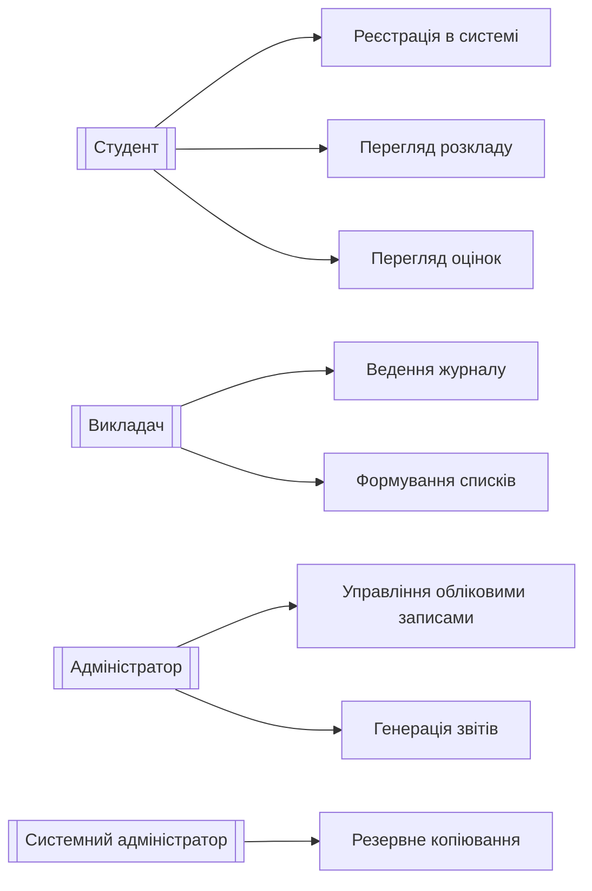

# Розділ 5: User Stories у UML-нотації

```mermaid
flowchart LR
    Student[["Студент"]] --> Register["Реєстрація в системі"]
    Student --> Timetable["Перегляд розкладу"]
    Student --> Grades["Перегляд оцінок"]

    Teacher[["Викладач"]] --> Journal["Ведення журналу"]
    Teacher --> Lists["Формування списків"]

    Admin[["Адміністратор"]] --> Accounts["Управління обліковими записами"]
    Admin --> Reports["Генерація звітів"]

    SysAdmin[["Системний адміністратор"]] --> Backup["Резервне копіювання"]
```