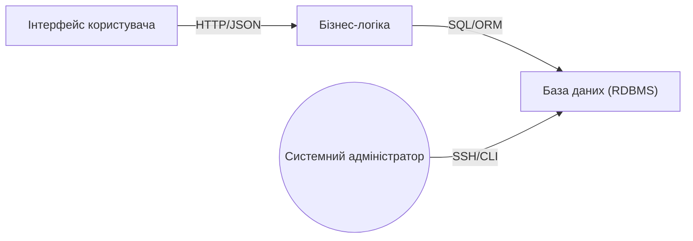

# Розділ 6: Архітектура системи та залежності між підсистемами

Система обліку студентів реалізується за класичною трьохрівневою архітектурою:

1. **Презентаційний рівень (UI)**
   - Веб-інтерфейс для користувачів.
   - Відповідає за відображення форм, таблиць та введення даних.

2. **Бізнес-логіка (додаток)**
   - Проміжний шар, який обробляє запити від UI.
   - Валідація введених даних, виконання обчислень.
   - Розподіляє права доступу згідно ролей користувачів.

3. **Рівень збереження (БД)**
   - Реляційна база даних (PostgreSQL, MySQL тощо).
   - Таблиці: `students`, `courses`, `enrollments`, `grades`, `users`.

## Залежності між підсистемами

- UI звертається до бізнес-логіки через REST‑API (HTTP/JSON).
- Бізнес-логіка використовує ORM або SQL‑запити для взаємодії з базою.
- Системний адміністратор користується окремими скриптами для резервування, що напряму доступають БД.

