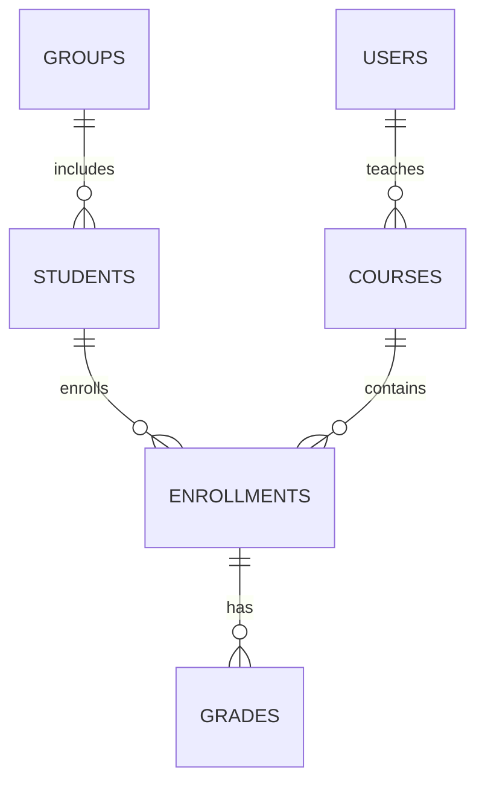

# Розділ 7: Модель даних

Для підсистеми збереження визначено наступні основні сутності та їх атрибути:

- **students** (студенти)
  - id (PK)
  - first_name, last_name
  - birth_date
  - email, phone
  - group_id (FK)

- **courses** (дисципліни)
  - id (PK)
  - name
  - credits
  - instructor_id (FK → users)

- **enrollments** (записи про зарахування)
  - id (PK)
  - student_id (FK → students)
  - course_id (FK → courses)
  - semester

- **grades** (оцінки)
  - id (PK)
  - enrollment_id (FK → enrollments)
  - grade_value
  - date_assigned

- **users** (облікові записи)
  - id (PK)
  - username
  - password_hash
  - role (student, teacher, admin, sysadmin)

- **groups** (навчальні групи)
  - id (PK)
  - name
  - department

Нижче наведена діаграма ER:

